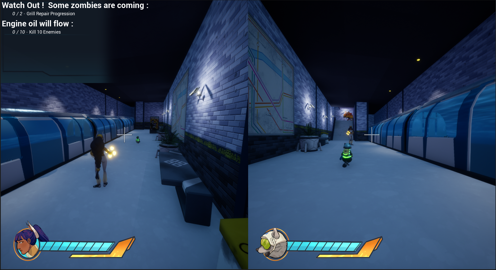
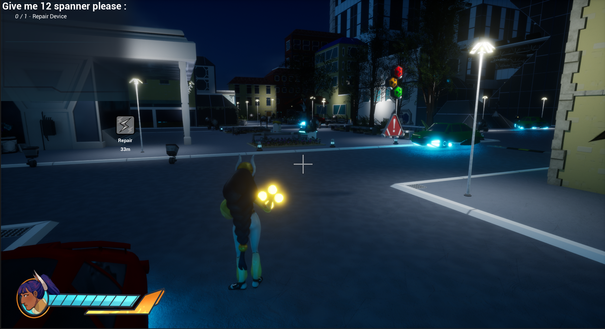
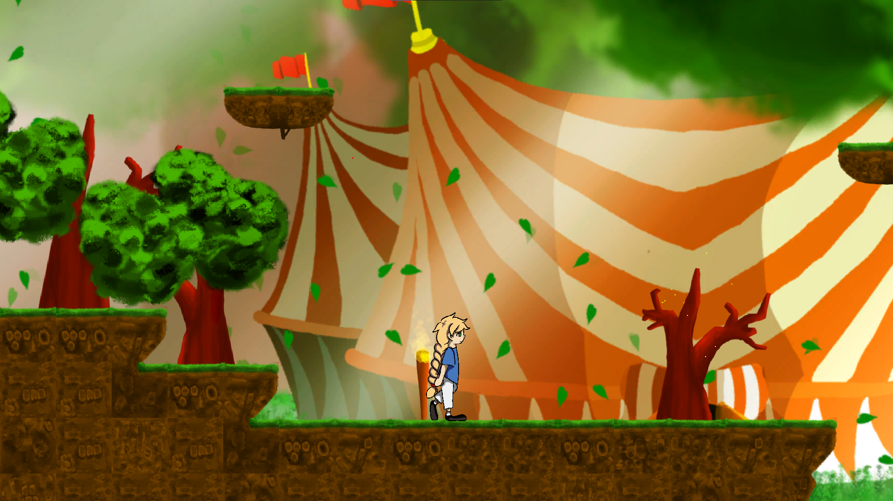
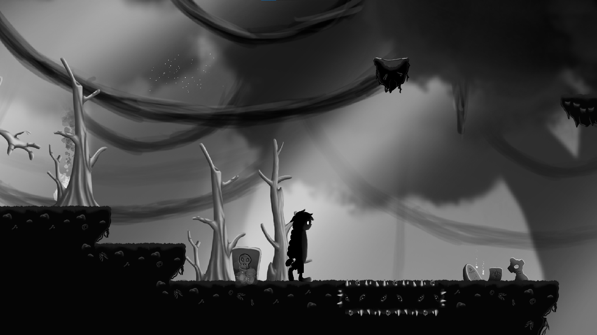

### Hi there 👋

<!--
**ZoSand/ZoSand** is a ✨ _special_ ✨ repository because its `README.md` (this file) appears on your GitHub profile.

Here are some ideas to get you started:

- 🔭 I’m currently working on ...
- 🌱 I’m currently learning ...
- 👯 I’m looking to collaborate on ...
- 🤔 I’m looking for help with ...
- 💬 Ask me about ...
- 📫 How to reach me: ...
- 😄 Pronouns: ...
- ⚡ Fun fact: ...
-->

- **Learner:** I mainly code because I find it fun!
- **Interests:** Exploring new technologies, building cool projects, and improving my skills.
- **Languages Enthusiast:** Coding in C, C#, Lua, and JavaScript, with a soft spot for C++.
- **Contact:**
  - Email: [zo.lambert@zosand.fr](mailto:zo.lambert@zosand.fr) (please DO **NOT** send marketing messages!!) 
  - LinkedIn: [Zo LAMBERT](https://www.linkedin.com/in/zo-lambert/)

Feel free to reach out to me!

---

## Projects

### Tentown Heroes

> [!NOTE]  
> Sources are private

Tentown Heroes is a third-person shooter (TPS) game we created during our final year at Creajeux, a programming school in Nîmes (France). The game is set in Tentown, where robots have gone haywire and started attacking people. Players become heroes, each with unique powers, sent to stop the robotic menace. Designed for local multiplayer, Tentown Heroes offers a game experience that encourages teamwork as players battle to save the town.

### Between 2 Worlds

> [!NOTE]  
> See https://github.com/Kissh2021/Between-2-Worlds

Between 2 Worlds is a small platformer we made during the Geneva Global Game Jam in 2022. The goal is to progress through the level while switching between two dimensions, activating and deactivating platforms. 

